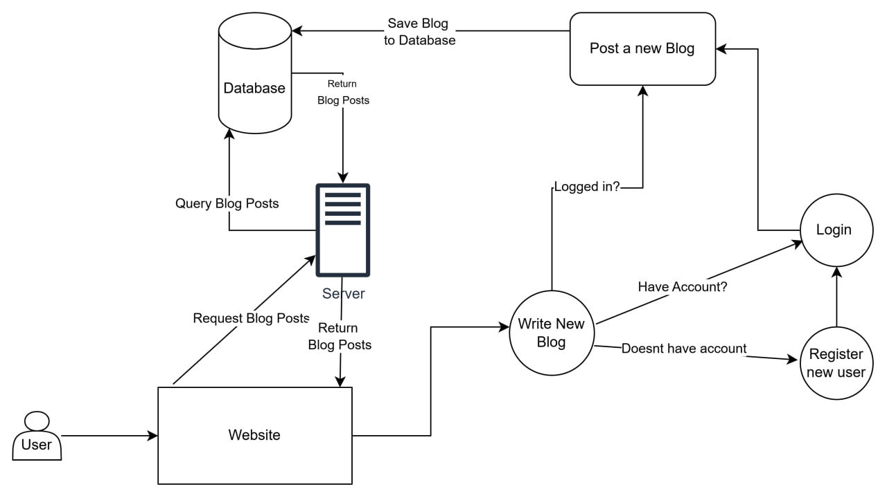

# Blog Project

## Overview

The Blog Project is a web application developed as part of the IT course using the SCRUM methodology. The project implements a simple blogging platform where users can perform CRUD (Create, Read, Update, Delete) operations on blog posts. The application is built with HTML, CSS, and Django for the backend. The development process was managed using JIRA, and version control was handled through Git.

## Tech Stack

- Frontend: HTML, CSS
- Backend: Django
- Database: SQLite (default database used with Django)
- Version Control: Git (GitHub repository for project code)
- Project Management: JIRA
- Diagramming Tool: Draw.io

## Functional Requirements

The core functionalities of the application include:

- Create: Users can create new blog posts.
- Read: Users can view a list of all blog posts.
- Update: Users can edit existing blog posts.
- Delete: Users can delete blog posts.

## Non-Functional Requirements

- Performance: The application must load pages within 3 seconds.
- Security: Basic security measures such as input validation and user authentication have been implemented.
- Scalability: The application is designed to handle up to 1,000 simultaneous users.

## Installation Instructions

1. Clone the repository:
   
```bash
   git clone https://github.com/javokhirbek1999/blog-project.git
```

2. Navigate to the project directory:
   
```bash
   cd blog-project
```

2. Make sure to setup a new virtual environment:

```bash
   python -m venv venv
```

3. Activate your new environment:

```bash
   .\venv\Scripts\activate
```

3. Install required dependencies:
   
```bash
   pip install -r requirements.txt
```   

4. Make the database migrations:
   
```bash
   python manage.py makemigrations
```

5. Migrate the database:

```bash
   python manage.py migrate
```

5. Start the development server:
   
```bash
   python manage.py runserver
```

6. Open your browser and visit your localhost at http://127.0.0.1:8000/ to view the application.

## Project Structure

- Frontend: HTML and CSS files are located in the frontend/ directory.
- Backend: Django application files are located in the backend/ directory.
- Database: SQLite database used by default.
- Diagrams: All project diagrams are stored in the diagrams/ folder and referenced in the README.

## Group Members

The following team members contributed to this project:

- Javokhirbek Khaydaraliev (ID: 40797)
- Aliia Sherikbaeva (ID: 62550)
- Aiana Ibraiim kyzy (ID: 41288)
- Yuldoshov Shakhzod (ID: 41821)
- Asadov Shukrulla (ID: 41156)

## Documentation

- The README provides an overview of the project, installation instructions, and project structure.
- The project’s progress and tasks were tracked in JIRA, following the SCRUM framework.
- Diagrams and additional documentation have been added to the repository for reference.

## Project Status

- Frontend: The frontend has been completed and is fully functional.
- Backend: The CRUD operations are fully implemented and tested.
- Demonstration: The project is now ready for demonstration and submission.
  # Backend

## Workflow of the web application

